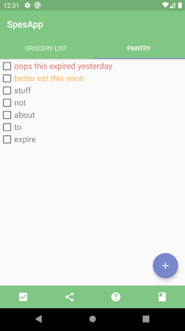

# SpesApp
SpesApp is __a grocery list app designed to help you avoid wasting food (and money!)__.

SpesApp automates the bookkeeping of two separate lists, one for items yet to buy and one for items to be bought: while at the store, you can check what you already have and avoid buying anything equivalent.

Features:
- a __single click__ allows you to move ticked grocery list items to pantry and delete ticked items in your pantry
- add an __expiration date__ and a __category__ to your ingredients: your grovery list will be ordered by category to help you save time while at the store and your pantry will be sorted by expiration date so you know what ingredients need to be consumed more urgently
- colors: __expired ingredients marked in red, ingredients expiring today marked in orange__
- __share__ your grocery list with whoever is going to the store with your favorite messaging app
- available in __English, Italian, bad Swedish and worse Spanish__

## Coming (relatively) soon: the cookbook
- collect your recipes in a simple cookbook
- see what you can cook with what you already have based on the recipes in you cookbook with a single click
- select meals you want to prepare and automatically add the missing ingredient to the shopping list
